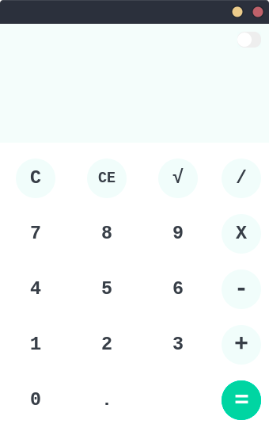
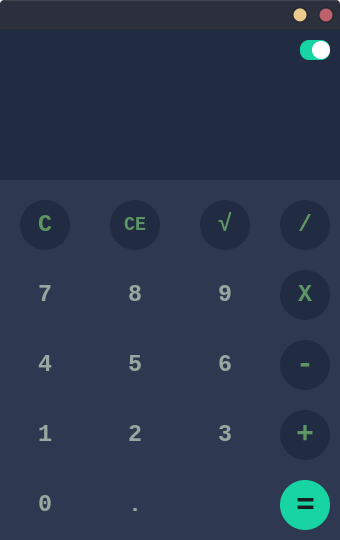

# JavaCalculator

 

## Features

* Great UI and UX.
* Light and dark mode.
* Addition, subtraction, multiplication, division and square root.
* Results as you type.

## Getting Started

1. Download the repository files from the download section or clone this project:
       https://github.com/Agslz/Java-Calculator.git
2. Import it in NetBeans or any other Java IDE.
3. Have fun 🚀.
